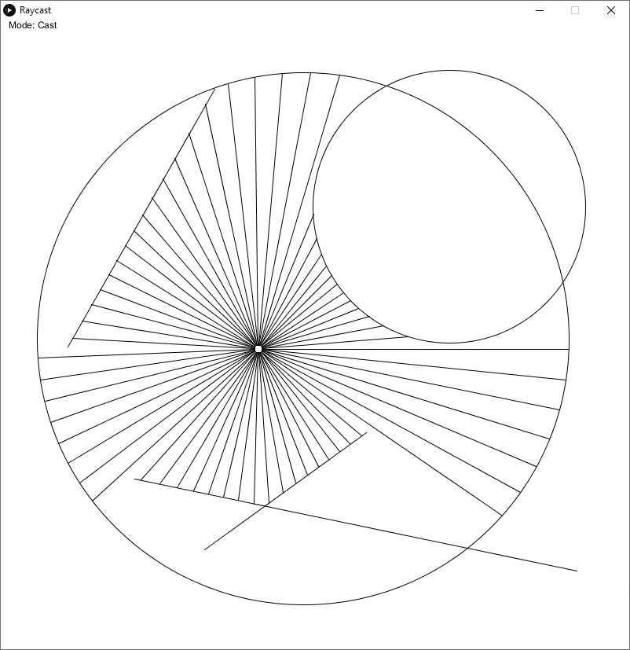

# Raycast

Raycast is a very simple raycasting implementation using the [Processing](https://processing.org/) framework for Java.

## Installation

To use the program, you first need to have Processing installed. Download it from the [official website](https://processing.org/download).

## Usage

### Opening the project
1. Make sure all of the .pde files are inside of a directory named after one of them.
2. Open the project by double-clicking on one of the .pde files and select the installed Processing version to open it.
3. Compile and run the sketch by pressing the arrow button in the top left corner.

### Using the program
In the top left corner of the window the current mode of the program is being displayed. By pressing the spacebar it is possible to cycle trough the different modes, which there are three of:  
1. LineDraw  
In this mode you can start drawing a new line by left-clicking somewhere in the sketch window.  
 The start point is set to the current mouse position and the end point of the line will follow the mouse until the left mouse button is pressed again, which sets the end point of the line to the current mouse position.
2. CircleDraw  
In this mode you can start drawing a circle by left-clicking somewhere in the sketch window. The center of the circle is set to the current mouse position and the radius is determined by the distance of the mouse to the center point which effectively makes the circle boundary follow the mouse.  
Once the left mouse button is pressed again the current radius will be locked in.
3. Cast  
In this mode the rays are casted and it is possible to see how the rays collide with the previously drawn lines and circles.  
The rays originate from near the mouse in a circle and facing outwards.

When in either the LineDraw or CircleDraw mode a line or circle has been started drawing both the escape key and the space key cancel the drawing of the current object.

## Example


## The math behind it

DISCLAIMER:  
I did not look up any of the following math/equations because I wanted to figure it out myself, so it is possible that there are better ways to do this or some of the calculations / explanations are actually wrong.

### Lines

#### Line Equations

Checking whether two lines intersect is not very hard, but requires to have the equations of both lines. So the first thing to do is to calculate the line equation using the starting and the end point.  
To do this, we first have to find which of the two points is farther away from the coordinate origin respectively to the x-axis. Due to the fact that in processing the origin is in the top left center and increments to the right for the x-axis and down for the y-axis we can simply check which of the two points' x-coordinate is greater.

With this knowledge we can now already calculate the slope of the line, which is defined as the ratio between the difference on the y-axis and the difference on the x-axis of the bigger point and the smaller point:  
  

Translated into code it looks like this:

``` java
float deltaX = biggerPos.x - smallerPos.x;
float deltaY = biggerPos.y - smallerPos.y;
slope = deltaY / deltaX;
```

For the y-intercept of the line we can rearrange the general linear equation to solve for the intercept:  
  
  
  

And substitute the terms with one of the known points:  
  

Once again translated into code it looks like this:

``` java
intercept = smallerPos.y - slope * smallerPos.x;
```

The lines are not infinite like the equations would suggest though, so we need to define the interval in which we would like the line to intersect with others.  
The lower interval bound is set to the smaller point's x-coordinate and the higher bound to the one of the bigger point.

Also there is a special case, whose equation calculation would result in an error: if the line is vertical, the calculation of the slope would be a division by zero. And since continuous functions are not allowed to have multiple y-values for one x-value, a vertical line cannot be represented by an equation.  
Instead we create a variable which just holds a boolean that indicates whether the line is vertical. Now the interval bounds are set to the two points' vertical positions instead. Because the interval is now only relevant for height, we need to store the x-coordinate of the vertical line in a separate variable.

#### Intersections

Now that we have the equations for both lines we can calculate if and where the two lines meet. For this step we can take two general linear equations:  
  


And then equate and rearrange them to solve for x:  
  
  
  
  

Which again as code can be written like this:

``` java
float x = (two.equation.intercept - one.equation.intercept) / (one.equation.slope - two.equation.slope);
```

Then, it is necessary to check whether the calculated intersection is inside the interval of both lines, because if it is not, there also is no "real" intersection as the lines do not extend to where they would meet.

Once again the situation is different if one of the two lines is vertical, because then it is not necessary (and actually wrong) to perform this calculation. Instead all that is needed to do is to calculate the vertical position of the non-vertical line at the position of the vertical one.  
This is easily done by inserting the x-coordinate of the vertical line into the equation of the non-vertical one:
``` java
float y = nonvertical.equation.calculateYAt(vertical.equation.horizontalPosition)
```
All that is left to do now is once again to check whether this y-coordinate is inside the interval of the vertical line and whether the x-coordinate of the vertical line is inside the interval of the non-vertical line.

### Circles

#### Intersections

It is a bit more complicated to check whether a line and a circle intersect than it is with just two lines. Because I did not know how to calculate this, I started with checking whether a given point is on a circle. To do that we just need to see if the distance between the point and the center is equal to the radius, which in turn can be accomplished by using the Pythagorean theorem:  
  

Substituting for coordinates gives us:  
  

Now if the given point is on a line, the y-coordinate of the point can be calculated using the x-coordinate:  
  

Inserting this into our original equation we now have an equation which can tell us if any single point of a line is on the circle:  
  

If we rearrange this equation to solve for x, we should have an equation which can tell us which points of the line are on our circle!  

At first, expanding and solving for x seems not to help us very much:  
  
  

But after a bit of ordering, summing up terms and grouping the equation into blocks it already looks like something:  
  

And now we just factorize :  
  

This reveals that the equation is actually a quadratic function!  

With this information, what we could do is to just plug it into the quadratic equation:  
  

It may seem pretty arbitrary to just plug this formula into the quadratic equation, but if you think about it, it actually makes a lot of sense to do so: We want to calculate the intersections of a line with a circle, which can be none (if the line just doesn't intersect with the circle), one (if the line is a tangent to the circle) or two (if the line crosses the circle). Coincidentally (or not), the quadratic equation returns zero, one, or two values for x, so it is a perfect fit indeed.  

With that out of the way, let's define our coefficients for the quadratic equation:  
  
  
  

It looks ugly here, and it doesn't look much better in code (for readability reasons I split up the terms into one line each):

```java
float a = + 1
          + line.equation.slope * line.equation.slope;
float b = - 2 * circle.pos.x
          + 2 * line.equation.intercept * line.equation.slope
          - 2 * line.equation.slope * circle.pos.y;
float c = + circle.pos.x * circle.pos.x
          + line.equation.intercept * line.equation.intercept
          - 2 * line.equation.intercept * circle.pos.y
          + circle.pos.y * circle.pos.y
          - circle.radius * circle.radius;
```

Now to figure out how many intersections there are, we can calculate the discriminant of the equation (which is the part below the square root):  
  

Which in code looks like this:  

```java
float discriminant = b * b - 4 * a * c;
```

Now as already mentioned, there are three cases which have to be taken care of:  
1. If the discriminant is greater than 0, there are two intersections.  
   In this case we have to compute both results of the quadratic equation by substituting   once with + and once with -.
2. If the discriminant is equal to 0, there is one intersection.  
   In this case we can just leave out the entire part after the  and compute the remaining equation.
3. If the discriminant is less than 0, there are no intersections.  

Because this calculation uses line equations too, it does not work with vertical lines. So we have to check for them too. The way those are calculated is to first check whether the horizontal position of the line is outside of, on or inside the circle. This can be checked for by comparing the absolute value of the difference between the horizontal position of the line and the x-coordinate of the circle with the radius of the circle. If the two values are equal, the intersection is the horizontal position of the line, if the radius is greater there are two intersections and if the radius is smaller there is no intersection.  

In every case with one or more intersections it is also necessary to check whether the intersections are inside the interval of the line.

There are also cases where after we check for interval inclusion we still have two possible values for the intersection. By comparing these values to the origin of the line it is possible to figure out which one is closer to it and thus the new endpoint for the line.

## Project Status

This project is pretty much done and unless somebody requests a feature, there are really only two things that I might add to this README at some point in the future.

* How I generate the rays starting from the mouse coordinates.
* Why the intersection of two overlapping lines (equal slope and intercept) is tricky to calculate.
